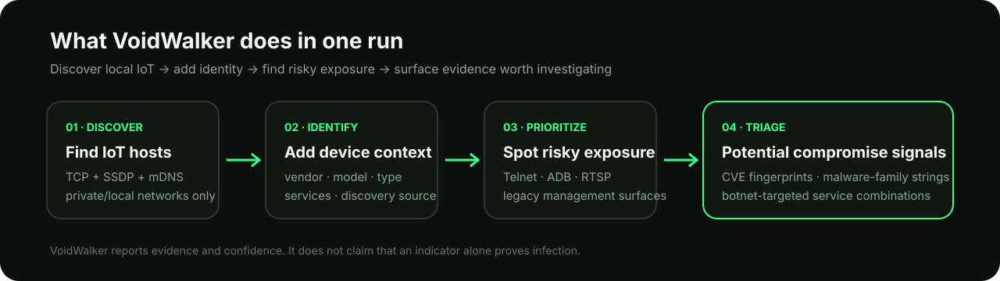
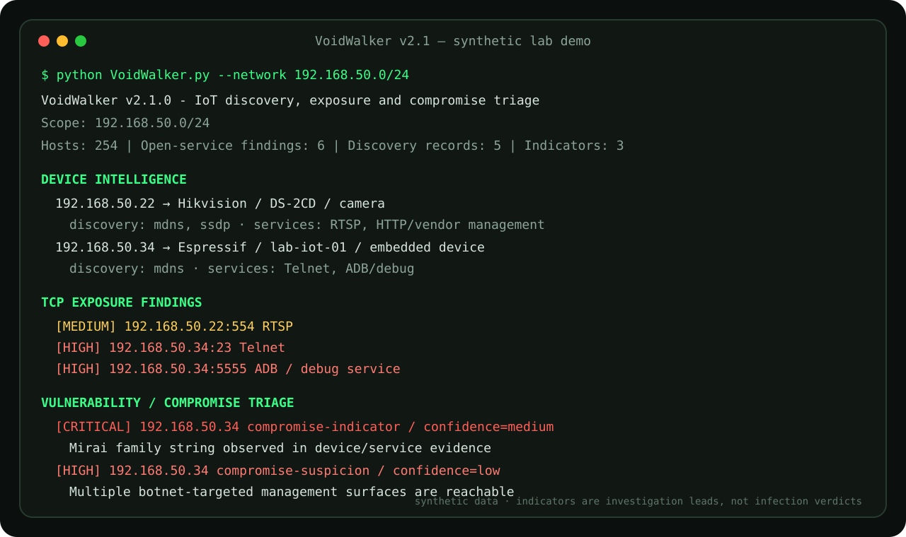

# VoidWalker

**Find IoT devices. See what they expose. Surface evidence that may indicate vulnerability or compromise.**


VoidWalker is a zero-dependency Python security auditor for **IoT and embedded devices on private/local IPv4 networks**.

It is not just a port scanner. In one run it combines TCP exposure checks with SSDP/UPnP and mDNS discovery, builds device context, and highlights hosts that deserve investigation because they show:

- risky IoT management/debug services;
- explicit vulnerable-software fingerprints;
- malware-family strings in collected evidence;
- combinations of services commonly targeted by IoT botnets.

The result is **triage, not a malware verdict**: every vulnerability or compromise signal carries a confidence level and should be validated with network, firmware, or forensic follow-up.

<p align="center">
  
</p>

## See it before reading the internals

The example below is a **synthetic lab run**, rendered from the current output model. It shows the part that matters most: device identity, exposure, and potential-compromise triage in one view.

<p align="center">
  
</p>

[**Open the full synthetic demo walkthrough →**](docs/DEMO.md)

## What VoidWalker actually gives you

| Output | Why it matters |
| --- | --- |
| **Device intelligence** | Correlates host, advertised name, manufacturer, model, device type, discovery source and observed services. |
| **Exposure findings** | Flags reachable IoT-relevant services such as Telnet, ADB/debug, RTSP, TR-069, MQTT and legacy vendor management. |
| **Vulnerability candidates** | Matches explicit software fingerprints such as affected RomPager or Boa versions and reports confidence + references. |
| **Compromise indicators** | Surfaces malware-family strings or suspicious combinations of botnet-targeted services as investigation leads. |
| **JSON output** | Exports findings, discovery records, devices and indicators for further analysis or ingestion into another workflow. |

### The key idea: find the device that deserves attention first

A generic scanner might stop here:

```text
192.168.1.50:23 open
192.168.1.50:5555 open
```

VoidWalker tries to turn those isolated facts into something more useful:

```text
192.168.1.50
  type: embedded / IoT device
  discovery: mDNS
  services: Telnet, ADB/debug

  HIGH: multiple botnet-targeted management surfaces reachable
  confidence: low
  action: investigate firmware, DNS and traffic
```

If collected evidence also contains a known malware-family string, the same host can be promoted to a **compromise indicator** with a higher severity while still avoiding the false claim that the device is definitely infected.

## Potentially compromised IoT detection

This is one of the main reasons VoidWalker exists.

The current triage engine can raise compromise-related signals when it observes:

- explicit strings associated with **Mirai**, **Gafgyt/BASHLITE**, **Mozi**, or **Satori** in collected service/discovery evidence;
- two or more reachable services from a set commonly targeted on embedded devices, including Telnet, alternate Telnet, ADB/debug, TR-069/CWMP and legacy vendor-management ports.

Example:

```text
[CRITICAL] 192.168.50.34 compromise-indicator / confidence=medium
           Mirai family string observed in device/service evidence

[HIGH]     192.168.50.34 compromise-suspicion / confidence=low
           Multiple botnet-targeted management surfaces are reachable
           evidence: tcp/23, tcp/5555
```

That means **"investigate this device now"**, not **"VoidWalker proved malware is running"**.

Follow-up should include traffic inspection, DNS review, model/firmware validation and vendor-specific analysis where available.

See [`docs/DETECTION_MODEL.md`](docs/DETECTION_MODEL.md) for the exact reasoning and confidence model.

## Vulnerability candidates

VoidWalker can also identify explicit software fingerprints that are strong enough to justify a CVE candidate.

| Observed fingerprint | Candidate | Confidence |
| --- | --- | --- |
| RomPager `4.34` or earlier | CVE-2014-9222 | High |
| Boa `0.94.14rc21` | CVE-2018-21027, CVE-2018-21028 | High |

A candidate still requires confirmation of the device model, firmware and vendor integration before being treated as a confirmed vulnerability.

## Quick start

Requirements:

- Python 3.11+
- no third-party runtime dependencies

Audit the detected local `/24`:

```bash
python VoidWalker.py
```

Audit an explicit private subnet:

```bash
python VoidWalker.py --network 192.168.1.0/24
```

JSON output:

```bash
python VoidWalker.py --network 192.168.1.0/24 --json
```

Disable multicast discovery and use TCP-only mode:

```bash
python VoidWalker.py --network 192.168.1.0/24 --discovery off
```

Use a custom port set:

```bash
python VoidWalker.py --network 192.168.1.0/24 --ports 22,80,443,554,8000-8010
```

## How it works

```text
private/local IPv4 scope
        │
        ├── bounded concurrent TCP connect scan
        ├── SSDP / UPnP discovery
        ├── mDNS / DNS-SD discovery
        ├── bounded same-host device-description metadata
        │
        ▼
 device/vendor/type correlation
        │
        ├── exposure findings
        ├── vulnerability fingerprints
        └── compromise indicators
        │
        ▼
 terminal report or JSON
```

### Discovery

VoidWalker queries local SSDP/UPnP and mDNS/DNS-SD services and correlates records by host. Where permitted by its safety boundary, it can fetch the same host's UPnP device-description XML to obtain fields such as friendly name, manufacturer, model and device type.

### TCP exposure

The default IoT profile includes services commonly relevant to embedded-device triage, including FTP, Telnet, SMB, RTSP, IPP, MQTT, ADB/debug, TR-069/CWMP, alternate web-management ports and selected legacy vendor-management services.

### Evidence collection

Service evidence is intentionally lightweight: passive banners where available and minimal HTTP `HEAD` requests for selected web services. There is no authentication attack, exploitation or remote command execution.

## Safety boundaries

VoidWalker is intentionally constrained:

- private, loopback or link-local IPv4 only;
- public Internet ranges are rejected;
- maximum 4096 addresses per scope;
- no credential attacks;
- no exploitation;
- no persistence;
- no remote command execution;
- SSDP description retrieval is same-host, HTTP-only, capped and does not follow redirects.

This keeps the project focused on **authorized discovery and defensive triage**.

## JSON model

Reports expose:

```text
tool
version
network
hosts_scanned
ports_scanned
findings[]
discovery_records[]
devices[]
indicators[]
duration_ms
interrupted
```

This makes VoidWalker usable both as a standalone CLI and as a data source for a larger security workflow.

## Testing and CI

```bash
python -m unittest discover -s tests -v
python -m compileall -q .
```

CI runs on Python 3.11, 3.12 and 3.13 and also validates Ruff lint/format checks. Tests use localhost-only TCP integration and offline parser/signature fixtures; CI does not scan external systems.

## Limitations

VoidWalker is a triage tool, not a replacement for a vulnerability scanner, EDR, packet-analysis platform or firmware-analysis workflow.

Current limitations include IPv4-only operation, no authenticated device inspection, no SNMP inventory, no firmware reverse engineering, multicast dependence on local network behavior, and the fact that malware frequently exposes no recognizable banner at all.

## Documentation

- [Synthetic demo](docs/DEMO.md)
- [Detection and confidence model](docs/DETECTION_MODEL.md)
- [Security model](SECURITY.md)
- [Changelog](CHANGELOG.md)

## Legal and ethical use

Use VoidWalker only on networks and devices you own or are explicitly authorized to assess.

## License

MIT. See [`LICENSE`](LICENSE).
